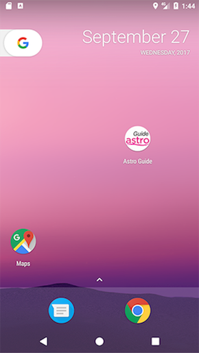
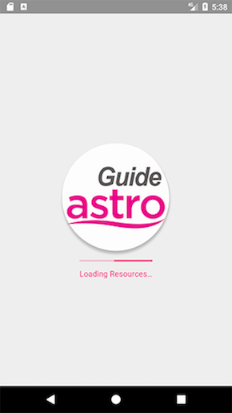
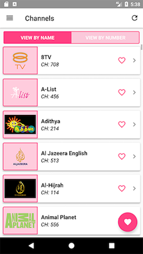
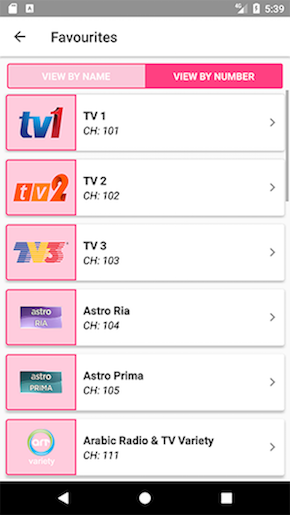
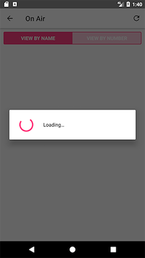
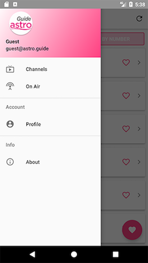
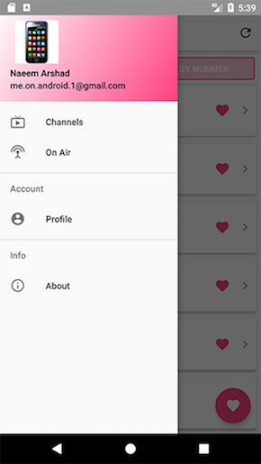
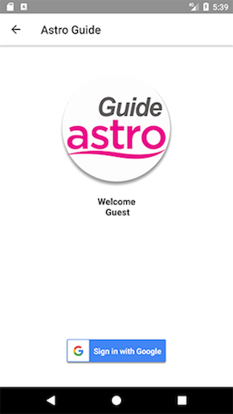
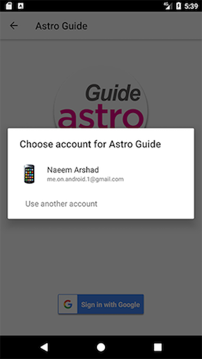
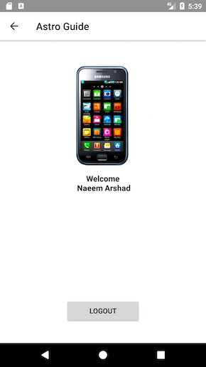

# Astro Guide #

Demonstration of Requirements understanding, proposing a solution and implementation by using latest tools and techniques. The code is based on Google Android SDK.

### What is this repository for? ###

* This app is built as assignment. 
* Adds different libs to enhance the application quality and performance
* Version 1.0.0

### Application Flow ###

- A: User Clicks on App Icon for device 
- B: Splash appear
- C: After splash delay, Home Screen Appears
- D: It loads Channel list on HomeScreen, if network is available
- E: After list loaded, on click of Favorite button, a dialog will appear with prompt
- F: If list row is clicked, it will show you details screen for that clicked elemnt
- G: From Navigation drawer, click on On Air and it will show you the list of channels with currently on-air events
- H: Two links to login screen, click Login button on prompt dialog or click Profile on Navigation Drawer menu
- H: Click Profile on Navigation Drawer menu to logout after a successful login
- I: user can login using Google Account
- J: **It will update the events/date time if use changes the timezone of the device**

## How do I get set up? ##

### How to set up ###
To setup you need to clone this repo, from `master` or `develop` branch or some latest `TAG`

### Configuration ###
Please sync and resolve dependencies

## Requirements ##

- JDK 1.8
- [Android SDK](http://developer.android.com/sdk/index.html).
- Android N [(API 24) ](http://developer.android.com/tools/revisions/platforms.html).
- Latest Android SDK Tools and build tools.

## Libraries and tools included: ##

- Support libraries
- RecyclerViews and CardViews
- [RxJava](https://github.com/ReactiveX/RxJava) and [RxAndroid](https://github.com/ReactiveX/RxAndroid)
- [Retrofit 2](http://square.github.io/retrofit/)
- [Dagger 2](http://google.github.io/dagger/)
- [Butterknife](https://github.com/JakeWharton/butterknife)
- [Timber](https://github.com/JakeWharton/timber)
- [Glide](https://github.com/bumptech/glide)
- Functional tests with [Espresso](https://google.github.io/android-testing-support-library/docs/espresso/index.html)
- [Mockito](http://mockito.org/)
- [MVP Boilerplate](https://github.com/benoitletondor/Android-Studio-MVP-template)

## Storage ##
### Local Storage ###

- [`SharedPreferences`](https://developer.android.com/reference/android/content/SharedPreferences.html) are used for local persistance of preferences

### Remote Storage ###

- Using `AWS-EC2` instance
- http://104.199.224.26:8000/api with `GET` and `POST`
- Code for review is available in [server_aws/test-api.py](./server_aws/api-test.py)

#### SSO Auth ####
- Google Authentication API
#### Settings Persistance ####
- Using `AWS-EC2` instance with `Flask` app deployed to persist settings agaings a logged-in user. 

## External Tools: ##

- API-response DTOs are created by using [JSON2Schema](http://www.jsonschema2pojo.org/)

## Code Quality ##

Used `Android Lint` and `SonarLint`

## Distribution ##

The project can be distributed using [Google Play Store](https://github.com/Triple-T/gradle-play-publisher).

## Contribution guidelines ##

- forks are always appreciated

## Screenshots ##

